**📌 ASP.NET Core MVC -- Başvuru ve Yetkilendirme Sistemi**

Bu proje, **Gençlik ve Spor Bakanlığı Bilgi İşlem Daire Başkanlığı --
Yazılım Hizmetleri Şubesi** staj sürecinde geliştirilmiştir.\
Projede; kullanıcı yönetimi, başvuru işlemleri, referans yönetimi,
yetkilendirme, loglama ve oturum yapıları içeren kapsamlı bir MVC
mimarisi uygulanmıştır.

**🚀 Kullanılan Teknolojiler**

-   **ASP.NET Core MVC (.NET 6+)**

-   **Entity Framework Core**

-   **SQL Server Management Studio (SSMS)**

-   **AJAX (jQuery)**

-   **Bootstrap Teması Entegrasyonu**

-   **Session Management**

-   **Repository / Service Yaklaşımları (Loglama)**

**📂 Proje Yapısı**

/Controllers

/Models

/Views

/wwwroot

/assets (Bootstrap tema dosyaları)

/Services

**🎨 Tema Entegrasyonu**

Proje arayüzünde modern bir görünüm için Bootstrap tabanlı hazır tema
kullanılmıştır.

**📝 Başvuru Formu**

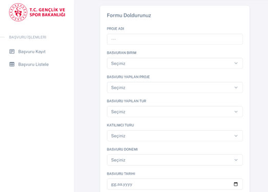

Kullanıcıların başvuru yapabileceği bir form oluşturulmuştur. Başvurular
veritabanındaki **tbl_basvuru** tablosuna kaydedilir.

**💾 Entity Framework ile Model Oluşturma**

Veritabanı modelleri EF Core ile otomatik üretildi:

scaffold-dbcontext -provider Microsoft.EntityFrameworkCore.SqlServer

-connection
\"Server=localhost\\SQLEXPRESS;Database=GSBTest;Trusted_Connection=True;TrustServerCertificate=True;\"

-OutputDir Models

**🔄 AJAX ile Veri Kaydetme**

Form verileri **sayfa yenilenmeden** AJAX ile kontrolöre gönderilir.

**📊 Başvuruların Listelenmesi**

Veriler tabloda gösterilir:

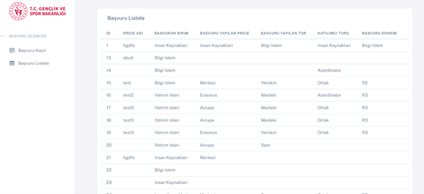

**🎯 Referans Yönetimi (TblRef)**

Referanslar (Tip / AltTip) için ayrı bir tablo tasarlandı.

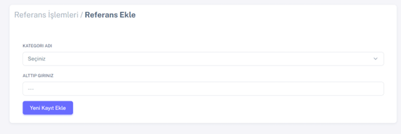 

**🔍 Başvuru Filtreleme**

Kullanıcılar başvuruları filtreleyebilir.

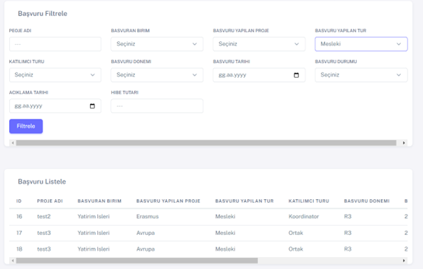

**👤 Kullanıcı Yönetimi**

Kullanıcılar için tblAccount tablosu oluşturulmuştur.

-   Kullanıcı adı

-   Şifre

-   Kayıt durumu (aktif/pasif)

-   Silinme durumu

-   Yetki kolonları

-   Admin kontrolü

\- Login işlemleri

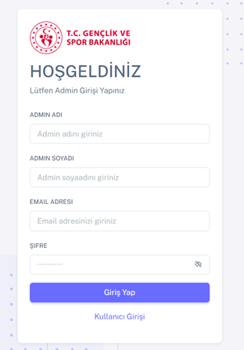 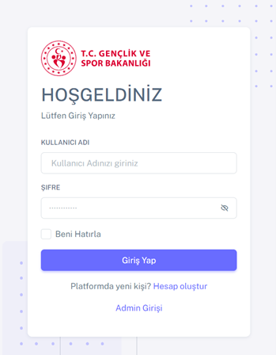

-Admin kullanıcı ekleme

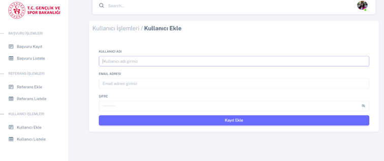

-Kullanıcı listeleme

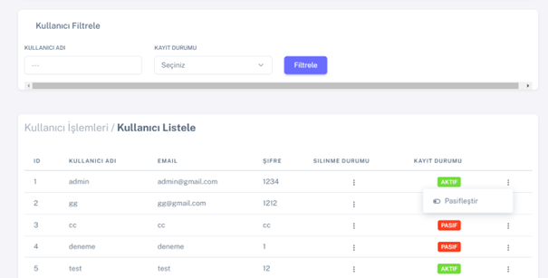

**🔐 Yetkilendirme Sistemi**

Admin kullanıcıları, diğer kullanıcıların şu yetkilerini yönetebilir:

-   Başvuru İşlemleri

-   Referans İşlemleri

-   Kullanıcı İşlemleri

Admin Yetkilendirme menüsü

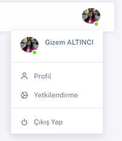

Yetkilendirme ekranı

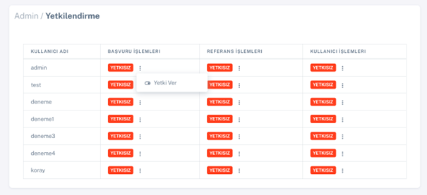

Yetki değişikliği tablosu

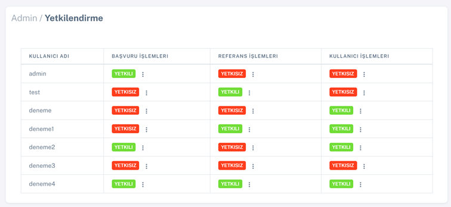

**🧾 Loglama Sistemi**

Her hareket ve hata için log kaydı tutulur.

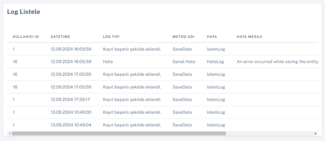

**🔚 Oturum Yönetimi**

Çıkış işlemi session temizlenerek yapılır.

**📘 Staj İçeriği**

Bu proje, staj sürecinde aşağıdaki konuların pekiştirilmesini
sağlamıştır:

-   .NET Core MVC mimarisi

-   Veri tabanı tasarımı ve EF Core kullanımı

-   Session tabanlı kullanıcı yönetimi

-   Yetkilendirme yapıları

-   AJAX kullanarak modern arayüz geliştirme

-   Loglama servisleri

-   Admin panelleri oluşturma

-   Bootstrap tema entegrasyonu
